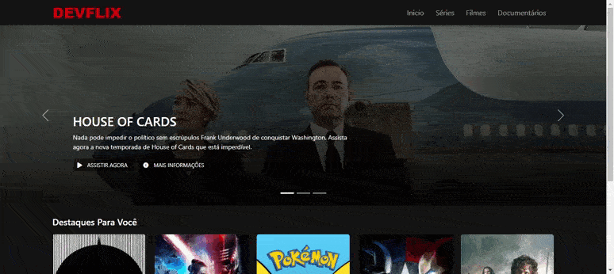

# Recriando a Interface da Netflix 🎬

> Projeto criado na [Digital Innovation One](https://dio.me/)! Recriando a interface da Netflix com HTML, CSS e JS.

Fiz algumas alterações com base no [projeto original](https://github.com/felipeAguiarCode/netflix-clone) e utilizei o Bootstrap. Criei um carrosel de filmes na página inicial, permitindo colocar várias obras em destaque, e também fiz mais algumas alterações de estilo no box de filmes. Segue a captura de tela: 

!

